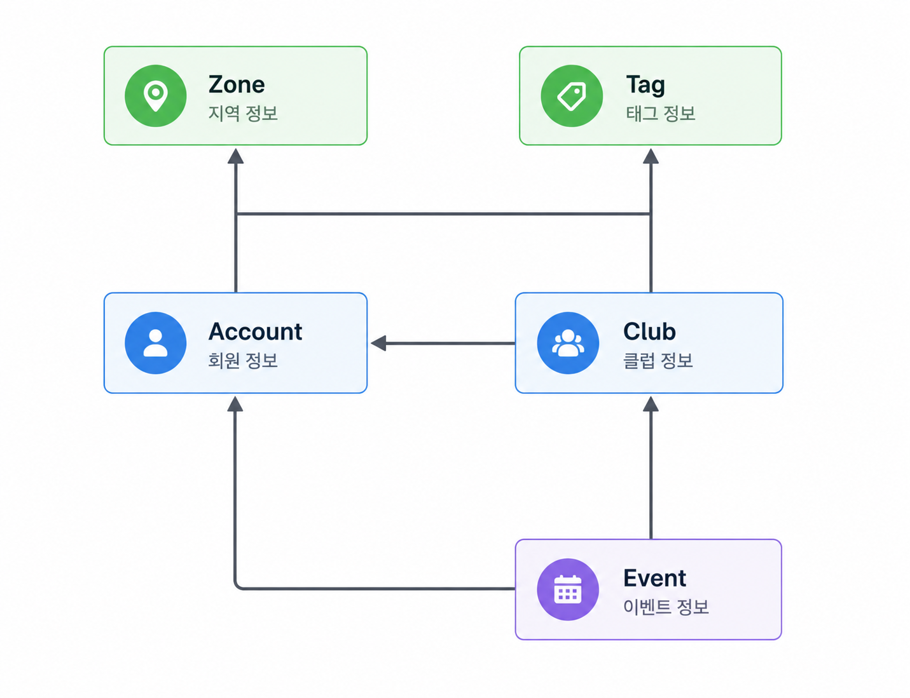

# 🏃 Move Together
[](https://github.com/JSH1990/moveTogether/actions)

운동을 함께 즐기고 사람들과 소통할 수 있는 커뮤니티 플랫폼입니다.  
클럽 생성, 모임(Event) 관리, 참가 신청, 알림 기능 등을 제공하며  
Spring Boot 기반으로 개발되었습니다.

---

# 📌 프로젝트 소개

Move Together는 운동을 좋아하는 사람들이  
관심사 기반 클럽을 만들고 모임을 주최하며 함께 운동할 수 있는 커뮤니티 서비스입니다.

사용자는:

- 운동 클럽 생성
- 관심 태그 및 지역 설정
- 이벤트(모임) 생성
- 참가 신청 및 승인
- 실시간 모임 상태 확인
- 이메일 인증 및 로그인

등의 기능을 사용할 수 있습니다.

---

# 🛠 기술 스택

## Backend

- Java 17
- Spring Boot
- Spring MVC
- Spring Data JPA
- Spring Security
- QueryDSL
- JPA (Hibernate)

## Frontend

- Thymeleaf
- Bootstrap
- jQuery

## Database

- PostgreSQL

## Test

- JUnit 5
- MockMvc
- AssertJ
- ArchUnit

## Tool

- IntelliJ IDEA
- Gradle

## DevOps / CI

- GitHub Actions

---


# 📂 프로젝트 구조

```text
src
 └─ main
     └─ java
         └─ com.movetogether
             └─ modules
                 ├─ account
                 ├─ club
                 ├─ event
                 ├─ enrollment
                 ├─ notification
                 └─ ...
```

도메인 중심(Module Based) 구조로 구성하였으며,  
각 모듈은 Controller / Service / Repository / Entity 역할을 분리하여 관리합니다.

---

# ✨ 주요 기능

## 👤 회원 기능

- 회원가입
- 이메일 인증
- 로그인 / 로그아웃
- 프로필 수정
- 관심 운동 설정

---

## 🏟 클럽 기능

- 클럽 생성
- 클럽 소개 수정
- 태그 설정
- 지역 설정
- 클럽 관리자 기능

---

## 📅 이벤트 기능

- 모임(Event) 생성
- 선착순(FCFS) 모집 / 관리자 확인
- 참가 신청
- 참가 승인 / 거절
- 출석 체크(Check-In)

---

## 🔐 인증 / 보안

- Spring Security 기반 인증
- CSRF 보호
- 로그인 사용자 권한 처리
- 커스텀 인증 어노테이션 사용

---

## 🧪 테스트

- JUnit5 기반 테스트 코드 작성
- MockMvc를 이용한 Controller 테스트
- 서비스 계층 테스트
- 아키텍처 테스트(ArchUnit)

---

# 🗃 ERD

## Domain Structure



---

# 🔍 사용 기술 설명

## Spring Data JPA

객체 중심 데이터 접근을 위해 사용하였으며  
Repository 패턴을 통해 데이터베이스 접근 로직을 관리했습니다.

---

## QueryDSL

복잡한 동적 쿼리를 타입 안정성 있게 작성하기 위해 사용했습니다.

---

## Spring Security

인증 및 인가 처리를 위해 사용했습니다.

- 로그인 처리
- 권한 관리
- CSRF 방어
- 사용자 인증 정보 관리

---

## ArchUnit

모듈 간 순환 참조(Cycle Dependency) 및 아키텍처 규칙 검사를 위해 사용했습니다.

- 모듈 의존성 관리
- 계층 구조 검증
- 순환 참조 방지
- 유지보수성 향상

---

# 📸 화면 예시

## 메인 화면

- 클럽 목록 조회
- 인기 모임 확인

## 클럽 상세

- 태그
- 지역
- 소개
- 가입 여부

## 이벤트 화면

- 참가 신청
- 참가자 목록
- 모집 상태

---

# 📖 기술 적용 및 문제 해결

## N+1 문제 해결

`@NamedEntityGraph`를 사용하여 연관 엔티티 조회 시 발생하는 N+1 문제를 해결했습니다.

---

## DTO 매핑

ModelMapper를 사용하여 DTO와 Entity 간 변환 로직을 효율적으로 관리했습니다.

---

## 테스트 환경 구성

Docker 기반 PostgreSQL 환경에서 테스트를 진행하여 실제 운영 환경과 유사한 환경을 구성했습니다.

---

# 📌 개선 예정 사항

- JWT 기반 인증
- React 프론트엔드 분리
- Redis 캐싱 적용
- Kafka 기반 알림 처리
- Docker 및 CI/CD 구축
- AWS 배포